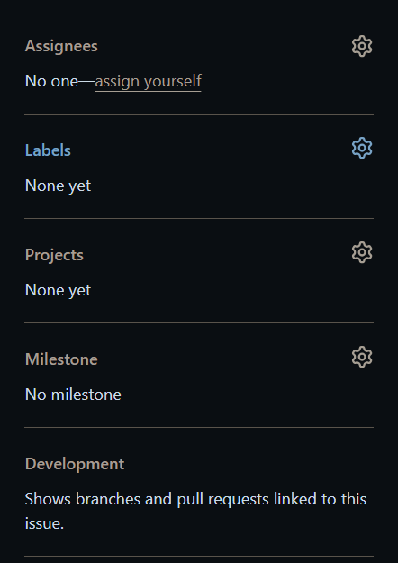

# Creating Issues in GitHub

GitHub Issues are a great way to track bugs, feature requests, and other tasks related to your project. Here's a step-by-step guide on how to create issues in GitHub:

1. **Navigate to the Repository**
   - Open your web browser and navigate to the [product-docs repository](https://github.com/jangala-dev/product-docs)

2. **Click on the "Issues" Tab**
   - On the repository page, locate the navigation bar at the top and click on the "Issues" tab.
   

3. **Click on the "New Issue" Button**
   - Once you're on the Issues page, you'll see a green "New Issue" button on the right side of the page. Click on it.
   

4. **Select the Issue Template (Optional)**
   - Some repositories have pre-defined issue templates that help you structure your issue. If available, select the appropriate template from the list.
   ![Placeholder for screenshot of issue templates]

5. **Enter the Issue Title**
   - In the "Title" field, provide a clear and concise title that summarizes the issue you're reporting.

6. **Write the Issue Description**
   - In the larger text area below the title, provide a detailed description of the issue. Include any relevant information, such as steps to reproduce the issue, expected behavior, and actual behavior.

7. **Add Labels, Assignees, and Milestones (Optional)**
   - On the right side of the issue creation page, you'll find options to add labels, assignees, and milestones to your issue. These help categorize and prioritize your issues.
   

8. **Attach Files (Optional)**
   - If you need to include screenshots, logs, or any other relevant files, you can drag and drop them or click the "Attach files" link at the bottom of the issue description area.
   

9. **Submit the Issue**
   - Once you've filled in all the necessary information, click the green "Submit new issue" button at the bottom of the page.
   

Congratulations! You've successfully created a new issue in your GitHub repository. This issue will now be visible to your team members, and you can track its progress, assign it to specific individuals, and collaborate on resolving it.

Remember, creating clear and detailed issues helps streamline the development process and ensures that important tasks are not overlooked.