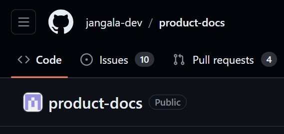
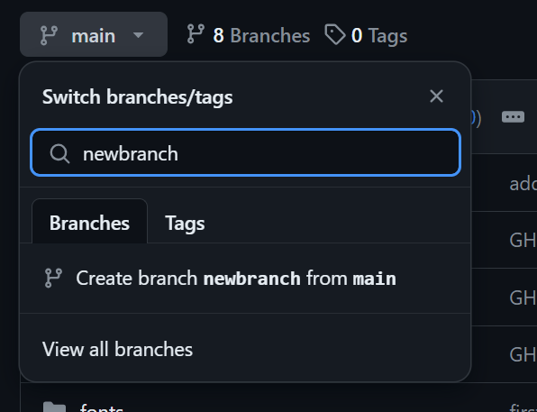
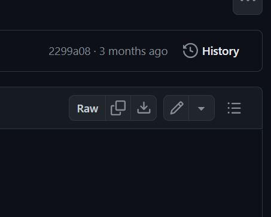
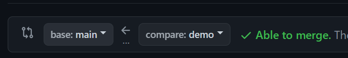

## Contributing to Product Documentation

Thank you for your interest in contributing to our product documentation! We welcome contributions from everyone to help improve the quality and clarity of our docs. This document outlines the guidelines and processes for contributing.

### Ways to Contribute

1. **Report Issues**: If you find any errors, typos, or areas that need improvement, please [open an issue](https://github.com/jangala-dev/product-docs/issues) and describe the problem. We'll review your issue and address it as soon as possible.

2. **Suggest Enhancements**: If you have ideas for new topics, examples, or improvements to existing content, feel free to [open an issue](https://github.com/jangala-dev/product-docs/issues) and describe your suggestions.

3. **Submit Pull Requests**: If you'd like to contribute directly to the documentation, you can submit pull requests with your changes. Please follow the guidelines below.

### Guidelines for Contributing

<video src="/contributing-video.mp4" width="320" height="240" controls></video>

1. **Open the GitHub repository**: Navigate to the [product-docs repository](https://github.com/jangala-dev/product-docs) on GitHub.

2. **Create a new branch**: Click on the `Code` tab and then click on the `Branch: main` dropdown. Enter a new branch name and click `Create branch`.

3. **Navigate to the docs folder**: Navigate to the [`docs`](https://github.com/jangala-dev/product-docs/tree/main/docs)  folder in the repository to find the documentation files you want to edit.
4. **Make changes**: Make your changes to the documentation using Github web Interface by clicking edit icon on the top right as shown in the below screenshot or using Local IDE. All the files are written in markdown format. You can refer to the [Markdown Guide](https://guides.github.com/features/mastering-markdown/) for help with formatting.

6. **Commit changes**: Once you've made your changes, commit them to your branch.

8. **Open a pull request**: Navigate to the `Pull requests` tab and click on `New pull request`. Select the branch you made changes to and the `main` branch. Click `Create pull request`.

10. **Describe your changes**: Provide a title and description for your pull request. Click `Create pull request` to submit it.
11. **Review and merge**: Your pull request will be reviewed by the maintainers. Once approved, it will be merged into the main branch.
12. **Delete your branch**: After your pull request is merged, you can delete your branch.

**Congratulations!**: You've successfully contributed to the product documentation.

**Thank you!**: We appreciate your contribution and look forward to more contributions from you in the future.

**Questions**: If you have any questions or need help with contributing, please feel free to reach out to us.

**Feedback**: We welcome feedback on the contribution process and are open to suggestions for improvement.

**Happy Contributing!**: We hope you enjoy contributing to our product documentation and look forward to your contributions.